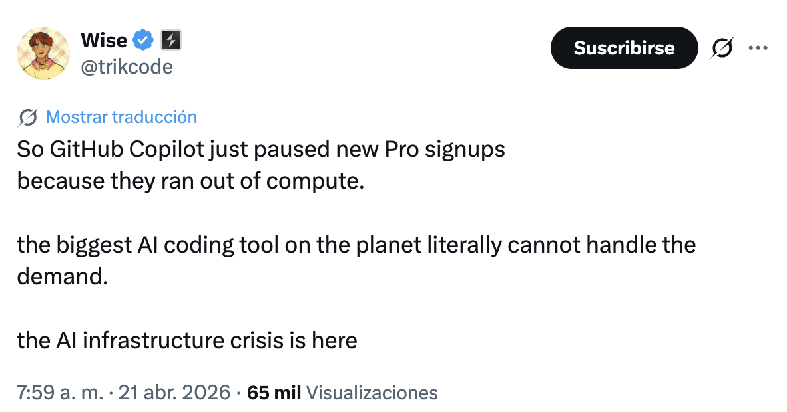
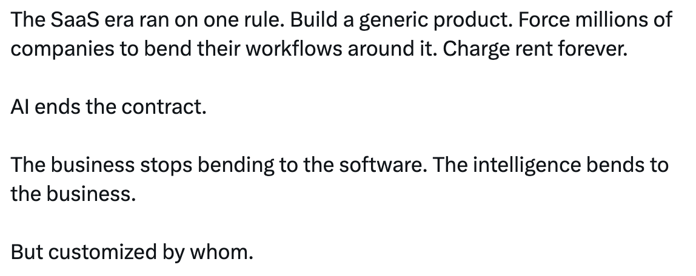

# <!--fit--> MalagaAI Networking
23 de Abril · San Jorge · dÍA del Libro

*Pablo Núñez · @pablonete*

<!-- footer: MalagaAI Networking · 23 Abril 2026 -->
<!-- paginate: true -->

# Generado con Marp
*Tenacitas genera sus slides* 🦀

# Keynote del AgentCamp
Presenté a **Tenacitas** en el [AgentCamp 2026 Keynote](https://github.com/pablonete/agentcamp-2026-keynote)

Un mes y medio de experimentos

# Multi-Tenacitas
Mi agente personal · siempre encendido

Grupo de Telegram con topics:
**General / Coder / Foto / Disco**

# El problema del /stop
No hay steering suave

`/stop` mata todo · `/steer` es para subagentes

Feature request: interrumpir sin matar el turno

# ¿Cuánto cuesta?
GitHub Copilot vs suscripciones Claude

+$1000/mes si tuviera que pagar tokens

# Capacity Paused
[@trikcode](https://x.com/trikcode/status/2046468778834235859)

# MiniPCs
Local small models

Modelo híbrido:
small local + powerful remote

NPUs · eGPU

# Vuelalto
Memories generadas con IA
Intentando convertirse en open-source

OpenShot · DigiKam · vuelafotos

# El pendulazo
La IA vuelve a la realidad

[La velocidad es el problema](https://x.com/i/status/2047029344166621547)

# Opportunity
[@r0ck3t23](https://x.com/r0ck3t23/status/2046282654161727722)

# Siri/Alexa
¿Cuándo le llegará la IA?

# Borges
> "una tarde, y solo esa tarde,
> lo supo todo de los druidas,
> de los drusos y de Dryden"

# <!--fit--> Gracias
*@pablonete*

MalagaAI
