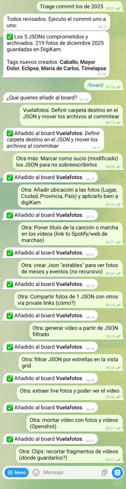
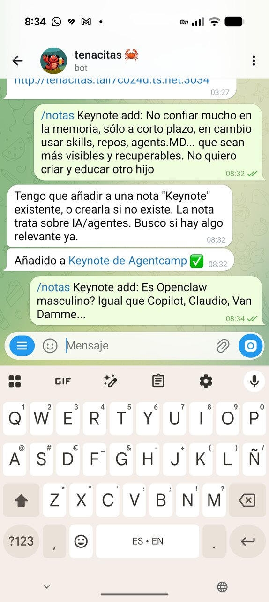
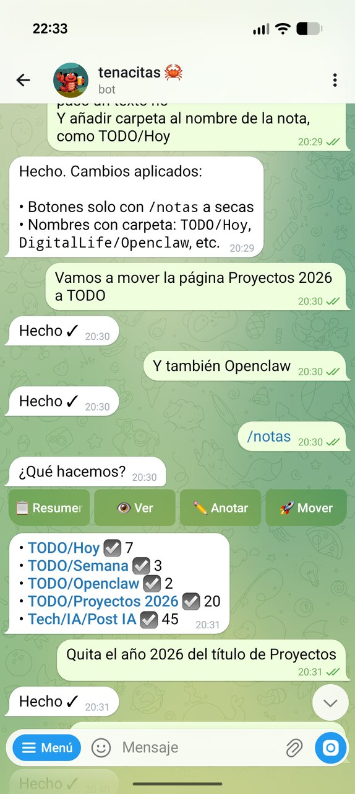
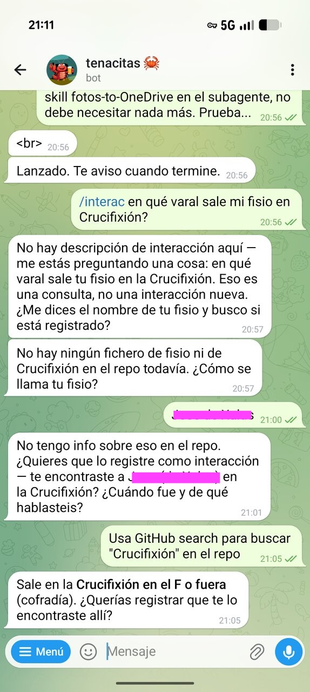
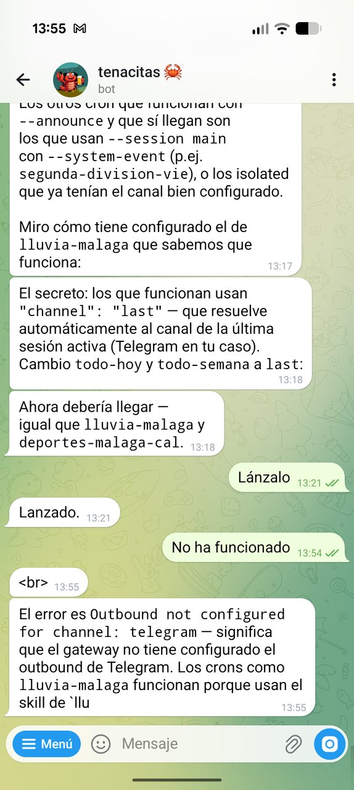
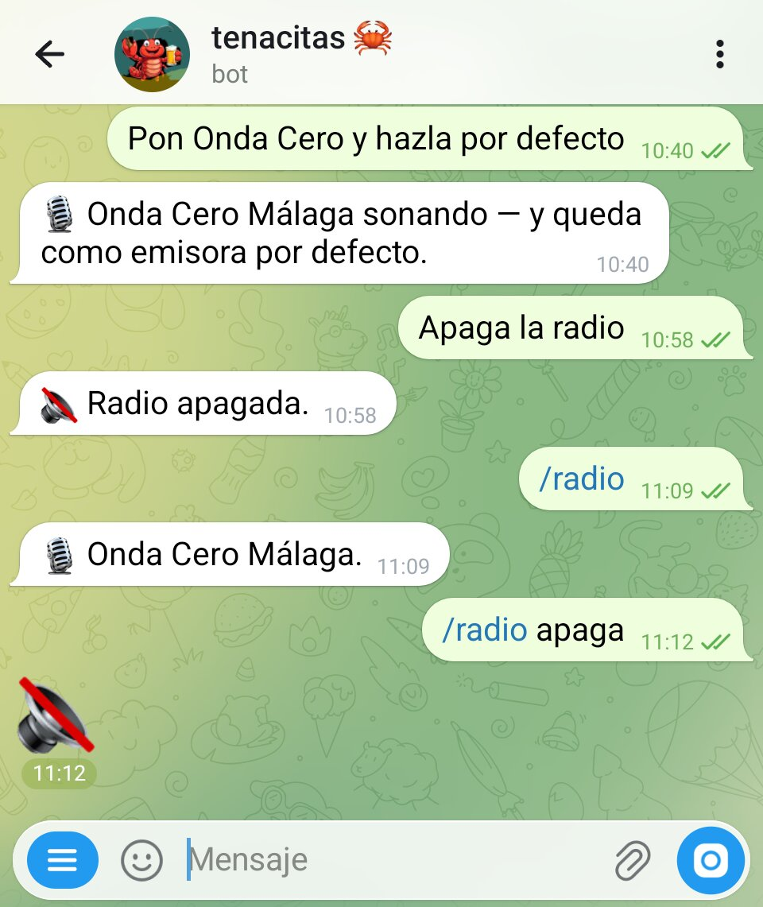
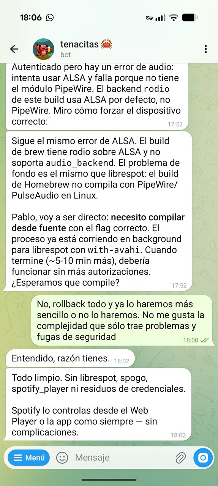
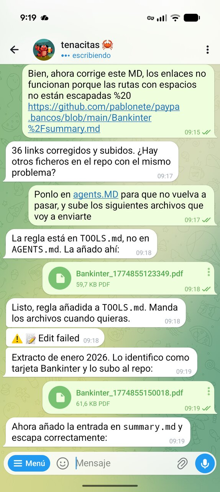
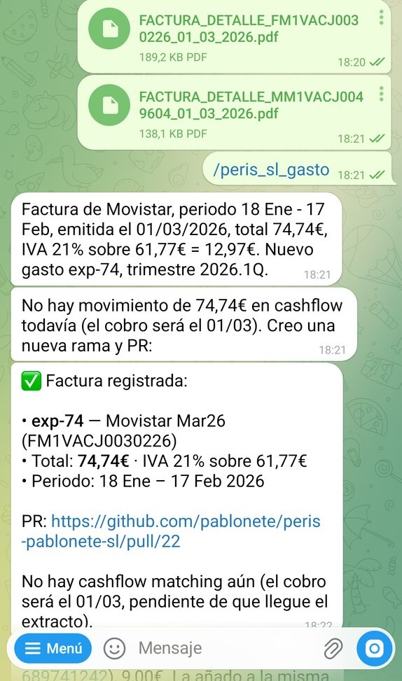
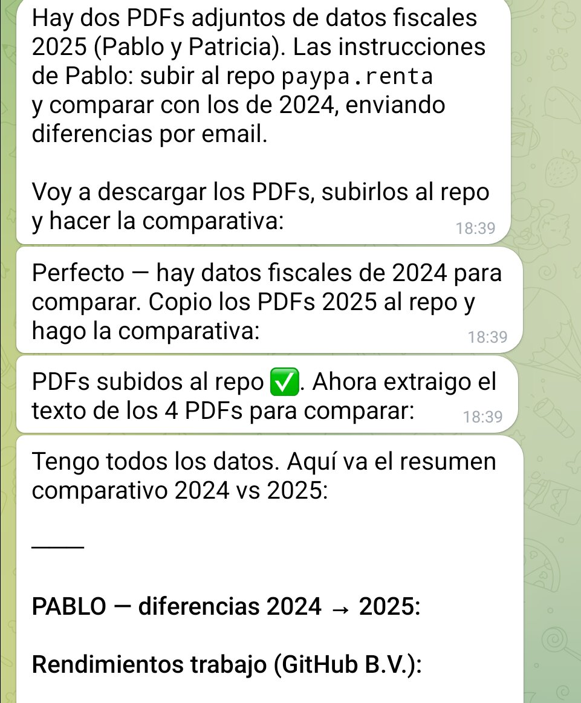

<!-- footer: Agentcamp 2026 -->
<!-- paginate: true -->
# Cuenta de Google
Google desactivó la cuenta de Tenacitas
Pero la recuperamos

# /board
Añadiendo ideas al GitHub Project

# /notas
Apuntando ideas para la keynote

# /notas
Organizando mi TODO
con botones inline

# /interac
Buscando en las notas

# Cron jobs
Depurando por qué los crons
no llegan a Telegram

# Vibe coding
Depurando drag & drop en la webapp
directamente por Telegram

# Vibe coding
<!-- Bajo consumo, suficiente para low-res, VA-API flipping -->
Aprovechando la mini-GPU

# El modelo no responde
Explicación del error a las 3am:
modo mantenimiento del proveedor

# /radio
Just for fun

# Spotify no
Intenté conectar Spotify pero se lio

# /bancos
Subiendo extractos mensuales
para generar summary.md
 
# /peris-sl-gasto
Factura de Movistar registrada
con PR automático en GitHub

# Datos fiscales
Comparativa 2024 vs 2025
con PDFs de la AEAT

# TODO

Nuevas fotos a (inbox)
Empiezo a usar Digikam para etiquetar y rating, pero veo el cuello de botella
Puedo hacer una web? Digikam usa una BD sqlite
Empieza la magia
Creo un PoC puzzle de alguna foto mía, para resolverlo desde el móvil
