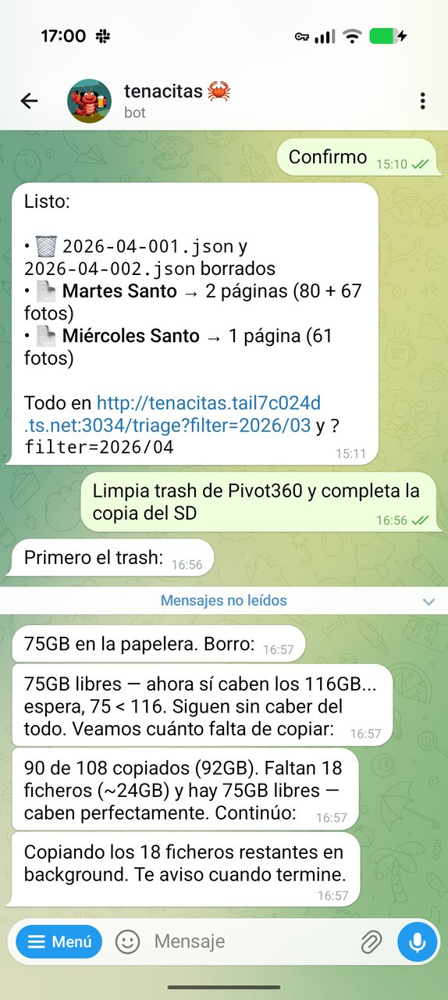
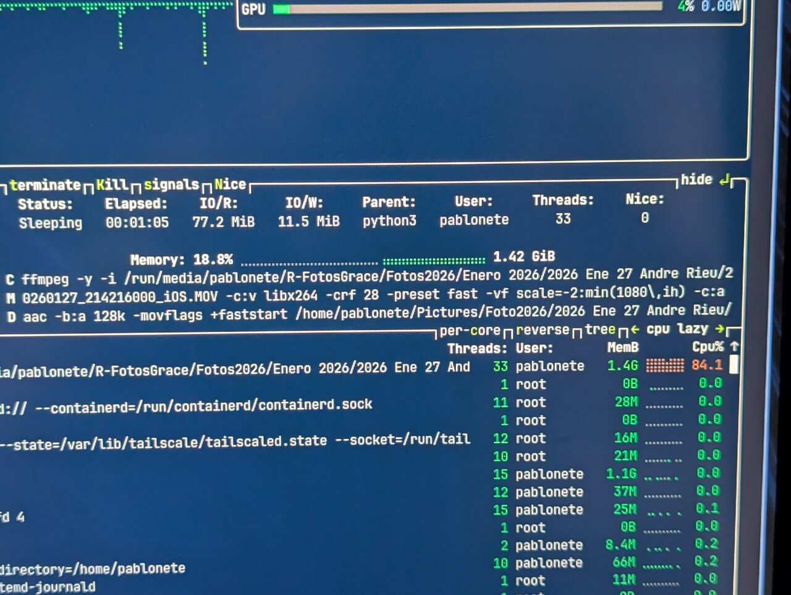

---

---
<!--
headingDivider: 1
theme: uncover
class: 
  - invert
style: |
  .columns { display: flex; gap: 1rem; }
  .columns > div { flex: 1 1 0; }
-->

# Keynote

# <!--fit--> ¿Esas fotos, dónde irán?
Bizcocho - Saeteros
https://youtube.com/clip/Ugkx5vroDIDXbeAZQISZT3JM7ktYtkY8ZMBF

# Presentación
Software Engineer at GitHub
Member of ~~MalagaDnug~~ DotNetMalaga AzureMalaga OpenSouthCode

<!-- footer: Agentcamp 2026 -->
<!-- paginate: true -->
# Fotógrafo
Nikon D40
Nikon D5500
Sony A6000
Insta360 X3

Fotógrafo compulsivo

Lightroom
# 
Disfruto más disparando que retocando
Bibliotecario frustrado, me gusta archivar

# Catálogos
Miles de fotos en HDDs desde 2007
Usé Google Photos mientras fue gratis
pero nunca lo vi como un reemplazo, not mine

# Workflow
Fotos de múltiples fuentes
Cámaras (desde SD)
Móviles (vía OneDrive)
Y VIDEOS!
Todo entra en (nuevas) donde esperan que las catalogue
Y luego exporto las 3* a OneDrive

# Etiquetado
- Rating
	- 2 estrellas: día
	- 3 estrellas: mes
	- 4 estrellas: año
	- 5 estrellas: best ever
- Tags
	- Personas. Face recognizition
	- Mascotas. No face recognition
	- `Playa`, `Bicicleta`, `Senderismo`
	- `Baloncesto`, `Fútbol`, `Unicaja`, `MálagaCF`
	- `Amanecer`, `Atardecer`, `Selfie`
	- `Fotografía`: artística (o simplemente no privada, se puede publicar)
	- `Semana Santa`: cofradías + trono + cristo|virgen
- Location
	- GPS no es lo mejor
		- No viene de réflex, 360...
		- Difícil buscar
	- Prefiero jerarquía: País > Provincia > Ciudad > Lugar

# Cuellos de botella
Muchos
- Ingestión (volcado lento)
- Etiquetar, varios pasos
- Revisita de ratings
- Requiere tiempo de foco en el ordenador
- Edición, aunque sea básica: niveles, crop, horizon-level

# Atascado
En 2025 estuve muy bloqueado
Lightroom OFF
	Modelo de licencia repulsivo
	Soy usuario cautivo
Distraido con la Insta360 que no encajaba en mi flujo
Llego a dejar de tirar fotos por no aumentar la bola de nieve

# Entre-veo la luz
Meses dándole vueltas a cómo aprovechar la IA en mi flujo
Carlos es testigo
Sé que tengo que abandonar Lightroom
Llevaba meses usándolo sólo para Reflex
Me da vértigo cambiar y decido trazar un plan
/giphy Formulas flying

# Necesito un Repo para planificar
Usar GitHub como persistencia para interacciones con IA usando MD
Escribo plan para usar Immich, tu propio Google Photos
La idea es servir mis fotos via web de forma privada
Desde un PC siempre encendido (bajo consumo!)
Y ya me caliento para usar un agente IA que me ayude
dhh vendiendo que lo primero que instala en un PC es LLM

https://x.com/dhh/status/2020156016629797193?s=20

# MiniPC Celeron
Decido ponerlo en un Linux ligero
	Recupero MiniPC abandonado
		Mi crío me lo devolvió porque no reproducía Youtube
	Instalo Omarchy (no tan ligero pero wow)
Al poco de empezar, volantazo
/giphy Coche salida autovia
Me paso a digiKam
	Face recognition 👍
	Rating and tagging 👍
	Location 👎 (via GPS)
Probé Darktable y no me convenció (además no soporta vídeos)

# Nace Tenacitas
Instalo OpenClaw y le creo Gmail y GitHub user
- No co-author
- No PAT para usar mis repos en mi nombre

Pablonete 

Tenacitas

# Skills de fotos

| Skill                 | Descripción                               |
| --------------------- | ----------------------------------------- |
| fotos-from-onedrive   | Descarga fotos del Camera roll al Inbox   |
| sd-to-hdd             | Copia fotos/videos de la tarjeta al Inbox |
| photos-digikam-backup | Copia el catálogo de Digikam              |
| photos-triage-start   | Genera 1 o más JSON de fotos en el Inbox  |
| photos-triage-commit  | Escribe rating & tags a fotos del Inbox   |
| photos-triage-search  | Busca fotos en Digikam                    |
| fotos-to-onedrive     | Exporta fotos 3* a OneDrive               |
| photos-to-movistar    | Backup videos 360 a Movistar Cloud        |
Se apoyan en algunos MCP

| MCP                | Descripción                                            |
| ------------------ | ------------------------------------------------------ |
| digikam-mcp        | Lee info de fotos, escribe atributos y ejecuta queries |
| movistar-cloud-mcp | Consulta y sube archivos a esa nube                    |

# <!--fit--> Paseando a Tenacitas
Algunas de mis conversaciones
con Tenacitas en Telegram
# Cuenta de Google
Google desactivó la cuenta de Tenacitas
y la recuperamos

# /board
Añadiendo ideas al GitHub Project

# /notas
Apuntando ideas para la keynote
desde el móvil

# /notas
Organizando el TODO
con botones inline

# /interac
Buscando en qué varal sale el fisio
en la Crucifixión

# Skills
Lista de skills disponibles
en Telegram con /

# /stop
A veces no ve cosas fáciles
y se lia

# Cron jobs
Depurando por qué los crons
no llegan a Telegram

# /fotos-from-onedrive
Arregla el lockscreen caído
y trae 481 fotos nuevas de golpe

# /sd-to-hdd
Volcando de la SD al HDD

# /sd-to-hdd
Ahora con nombre de evento

# Fotos Triage
Primera versión
Accesible desde el móvil vía Tailscale

# Fotos Triage
Generando JSONs por evento
y vaciando el disco

# Fotos Triage
Rediseño del flujo de carpetas:
triaging → triaged

# /photos-triage-search
Nuevo skill: buscar fotos
con lenguaje natural

# /fotos-to-onedrive
Debug de álbum raíz en DigiKam
para exportar 372 fotos de diciembre

# photo-open
Plan para compartir listas
de fotos públicamente

# Movistar Cloud
Descubriendo la API interna SAPI
para subidas sin timeout

# Movistar Cloud
Resolviendo la autenticación:
de Playwright a API

# Movistar Cloud
Se dio cuenta: streaming en lugar de
cargar archivos grandes en memoria

# Movistar Cloud
No recuerdes mi teléfono
¡Que no lo recuerdes!

# Vibe coding
Depurando drag & drop en la webapp
directamente por Telegram

# Vibe coding
Renderizando vídeo con GPU
y arreglando el vflip de VAAPI

# El MiniPC
ffmpeg al 84% de CPU
transcodeando vídeos

# El MiniPC
Celeron con btop a pantalla completa —
hace más de lo que parece

# El modelo no responde
Explicación del error a las 3am:
modo mantenimiento del proveedor

# /radio
Onda Cero Málaga
con un comando

# Spotify no
Intenté conectar Spotify pero se lio

# /bancos
Subiendo extractos mensuales
para generar summary.md
 
# /peris-sl-gasto
Factura de Movistar registrada
con PR automático en GitHub

# Datos fiscales
Comparativa 2024 vs 2025
con PDFs de la AEAT

# Test columns

## One

## Two

# TODO

Nuevas fotos a (inbox)
Empiezo a usar Digikam para etiquetar y rating, pero veo el cuello de botella
Puedo hacer una web? Digikam usa una BD sqlite
Empieza la magia
Creo un PoC puzzle de alguna foto mía, para resolverlo desde el móvil
Primer photo-triage

