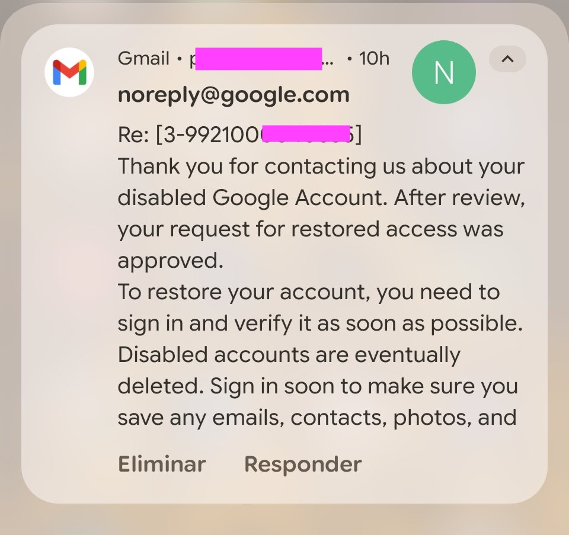
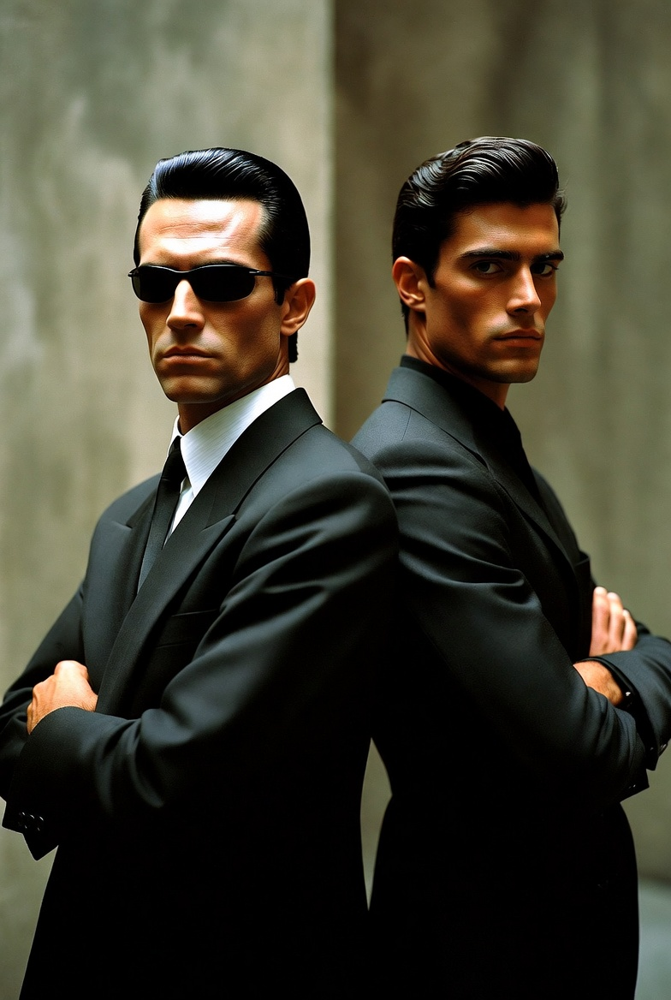
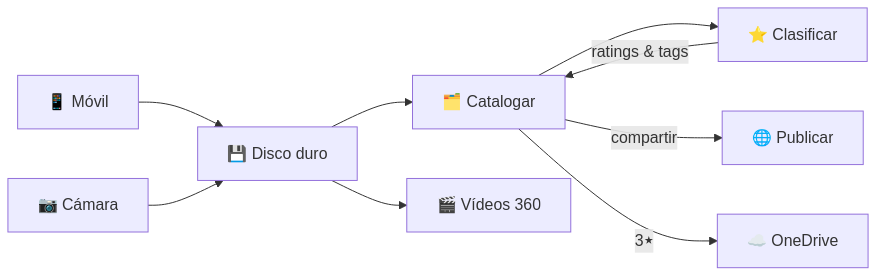
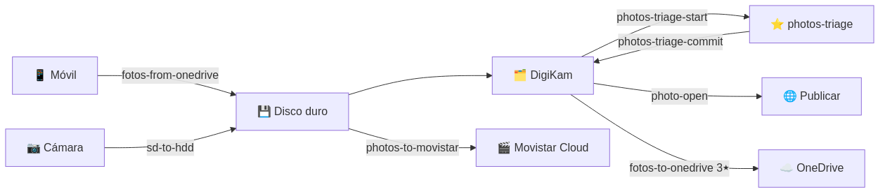
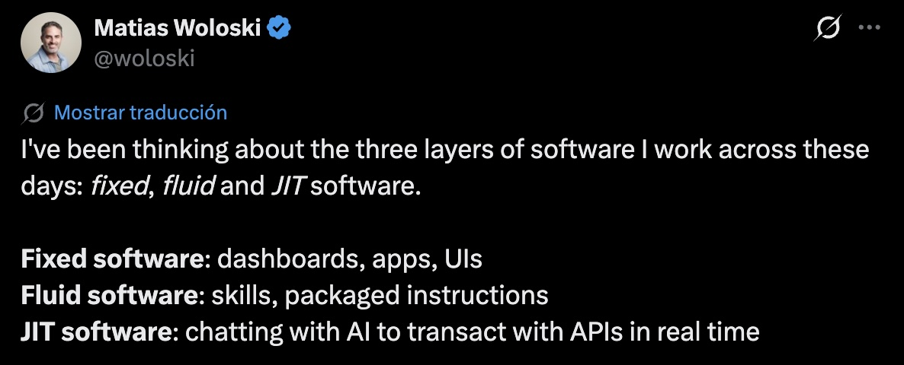
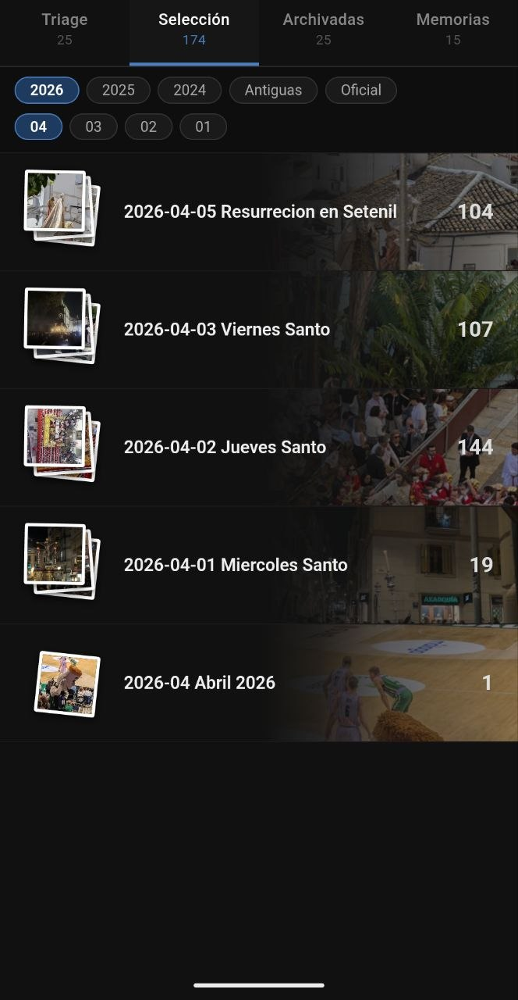
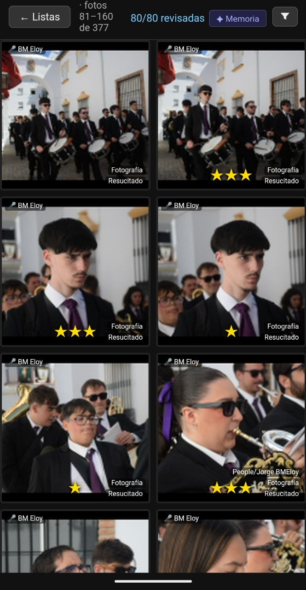
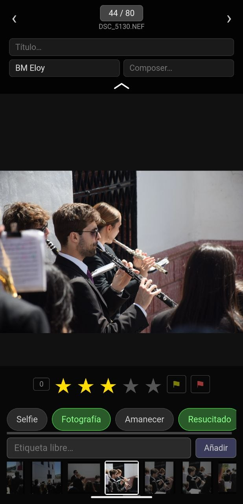
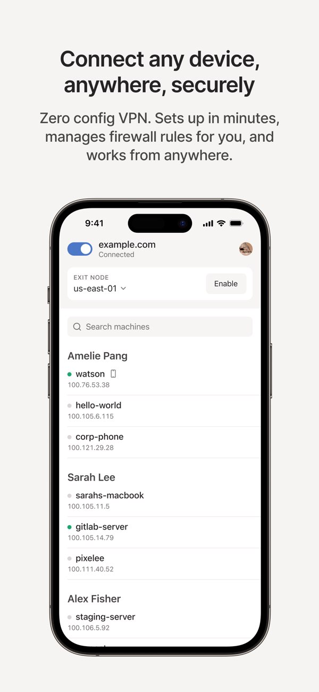

# <!--fit--> Keynote
Pablo Núñez
*@pablonete*

# Pablo Núñez

Software Engineer at GitHub

Miembro de 
- ~~MalagaDnug~~ DotNetMalaga 
- OpenSouthCode
- AzureMalaga 
- MalagaAI 
## @pablonete

<!-- footer: Agentcamp 2026 -->
<!-- paginate: true -->
# <!--fit--> Y esos vídeos, ¿dónde irán?

Bizcocho - [Saetero](https://youtube.com/clip/Ugkx5vroDIDXbeAZQISZT3JM7ktYtkY8ZMBF)

# Fotógrafo aficionado
Reflex, móvil, 360... y vídeos

Adobe Lightroom catalogs
Miles de fotos en HDDs desde 2007

Google Photos 👎

<!-- 
Disfruto más disparando que retocando
Bibliotecario frustrado, me gusta archivar

Usé Google Photos mientras fue gratis
pero nunca lo vi como un reemplazo, not mine
Colecciones dinamicas FTW
-->

# Workflow anterior
Fotos de múltiples fuentes
Cámaras (desde SD)
Móviles (vía OneDrive)
Uso un inbox y luego exporto las 3* a OneDrive

# Etiquetado
<!--
- Rating:
	- 2 estrellas: día
	- 3 estrellas: mes
	- 4 estrellas: año
	- 5 estrellas: best ever
- GPS no es lo mejor
	- No viene de réflex, 360...
	- Difícil buscar
-->
- Rating: 2*, 3*, 4*, 5*
- Tags
	- Personas, mascotas
	- `Playa`, `Bicicleta`, `Baloncesto`, `Fútbol`, `Amanecer`, `Selfie`
- Location por jerarquía:
	- País > Provincia > Ciudad > Lugar

# Cuellos de botella
- Ingestión (volcado lento)
- Etiquetar, varios pasos
- Revisión de ratings 🌟
- Requiere tiempo en el ordenador
- Edición, aunque sea básica: niveles, crop, horizon-level
## Yo

# Atascado
<!-- 
	Modelo de licencia repulsivo
	Soy usuario cautivo
	Cada vez más bloqueado en 2025, voy hacia atrás
	Llego a dejar de tirar fotos por no aumentar la bola de nieve
	Meses dándole vueltas a cómo aprovechar la IA en mi flujo
-->
- Adobe está matando Lightroom $ $ $
- Nueva Insta360 que no encajaba

- Tengo que aprovechar la IA
- Me da vértigo cambiar y decido trazar un plan

# Todo empieza con un Repo
<!--
servir mis fotos via web y catalogar y editar
Desde un PC siempre encendido (bajo consumo!)
-->
Trazo plan con Copilot
- PLAN.md
- Issues
- Project board
# MiniPC
<!--
N5095A
Mi crío me lo devolvió porque no reproducía Youtube
Al poco de empezar, volantazo
/giphy Coche salida autovia
Probé Darktable y no me convenció (además no soporta vídeos)
-->
Recupero MiniPC desahuciado
Celeron N5095A
Hace más de lo que pensaba

# Omarchy
Modern & Opinionated Linux

https://x.com/dhh/status/2020156016629797193?s=20

# OpenClaw
Tenía que ser open-source
¿El SO de la agéntica?
Modelo complejo de seguridad
Pero sigue teniendo riesgos

<!-- 
Las cosas cambian muy rápido, Openclaw es una sacudida. Anthropic ha cerrado el grifo esta semana y trastoca lo que mucha gente está haciendo. Pro y contra de ser OpenSource. Viva el OpenSource, es la única forma de hacer esto — una empresa no podría lanzar un producto como Openclaw

Llevo un mes con esto y cuando me planteo hacer la keynote digo "cómo le voy a enseñar yo a nadie". No pretendo que sea una charla en profundidad. No tengo ni siquiera para resolver dudas — solo puedo resolver sobre lo que yo he hecho, no sobre cómo funciona Openclaw, su modelo no es sencillo (modelo de seguridad, modelo de Chrome, modelo de agentes). No es trivial. Yo he conocido lo mínimo que he necesitado para ir haciendo progresos.
-->

# Nace Tenacitas
Su Gmail (no acceso a mi email)
Y su GitHub user
- No co-author, [sus commits](https://github.com/pablonete/agentcamp-2026-keynote/commits/main/slides)
- No PAT para usar mis repos en mi nombre

Pablonete 

Tenacitas

# Baneada
Google la desactivó
Skill `gog`  *parecía* un bot
Pero apelamos y 🥳

# El agente y el modelo

OpenClaw  agente
orquesta subagentes

Uso **Claude Sonnet 4.6** 
vía GitHub Copilot

<!-- 
OpenClaw es el runtime: gestiona sesiones, skills, canales (Telegram, Discord...).
El "cerebro" es el modelo de lenguaje — en mi caso Claude Sonnet 4.6, accedido gratis a través de GitHub Copilot.
Como cambiar el motor de un coche: el chasis (OpenClaw) es el mismo, el motor (modelo) puede ser otro.
-->
# Modelo en la nube
Under maintenance
En 1 mes esto me ha pasado 2 veces

# Immich 🛑
Tu propio Google Photos
auto-hospedado

No es lo que necesito ahora

# digiKam
- Open source 👍
- Face recognition 👍
- Rating and tagging 👍
- Location 👎 (via GPS)

# Nuevo Workflow

# Nuevo Workflow Skills

# Skills de fotos

| Skill                  | Descripción               |
| ---------------------- | ------------------------- |
| /fotos-from-onedrive   | Del Camera roll al Inbox  |
| /sd-to-hdd             | De la tarjeta al Inbox    |
| /photos-digikam-backup | Catálogo sólo             |
| /photos-triage-start   | JSON de fotos para review |
| /photos-triage-commit  | Graba review              |
| /photos-triage-search  | Busca en Digikam          |
| /fotos-to-onedrive     | 3* a OneDrive             |
| /photos-to-movistar    | Raw 360 videos            |

# MCPs

| MCP                | Descripción                                                                                 |
| ------------------ | ------------------------------------------------------------------------------------------- |
| digikam-mcp        | Lee info de sqlite Escribe tags, ratings... Search: ejecuta queries Mueve carpetas |
| movistar-cloud-mcp | Sube archivos a esa nube                                                                    |

# Escala
1. Chat - improvisa
2. Skill - flexible
3. Código - estable

https://x.com/woloski/status/2036251852312903943

<!--
Lo bueno de los skills: son flexibles. Mientras se ejecutan puedes estar opinando y cambiándole el comportamiento sobre la marcha.
-->

# <!--fit--> Paseando a Tenacitas
Algunas de mis conversaciones
con Openclaw en Telegram
# Skills
Nunca consigo que salgan todos

# /stop
A veces no ve cosas fáciles
y se lia

# /fotos-from-onedrive
Arregla el lockscreen caído

# /sd-to-hdd
Volcando de la SD al HDD

# /sd-to-hdd
Ahora con nombre de evento

# Fotos Triage
Custom webapp 
Para el móvil

# Fotos Triage
Seleccionar, rating y tags
en cada foto

# Fotos Triage
Guardado en JSON en GitHub
y commitado a DigiKam

# Tailscale
Túnel seguro entre dispositivos
y publicar con HTTPS

# /photos-triage-search
Skill para buscar fotos
Genera Json

# /fotos-to-onedrive
Incluyendo meses
Pide dry-run para validar

# Foto Open
Otra custom webapp
Para compartir fotos
- Public
- Unlisted

# Movistar Cloud
Descubriendo la API interna

# Movistar Cloud
Resolviendo la autenticación

# Movistar Cloud
Errores con archivos grandes
Se dio cuenta: usa streaming

# Movistar Cloud
No recuerdes mi teléfono
¡Que no lo recuerdes!

# Vibe coding
Depurando drag & drop via Telegram

> Vibe-coding is working as a QA fulltime.

https://x.com/pablonete/status/2036878616961638507

# Vibe coding
<!-- Bajo consumo, suficiente para low-res, VA-API flipping -->
Aprovechando la mini-GPU
para encoding de video 1080p

Hulio, ¿VA-API qué es lo que es?

# Mejoras futuras
- Location desde GPS
- Edición básica, automatizada
- Memory videos
- Auto tagging
- Añadir años pasados
- Publicar open-source MCPs y más

# Retro primer mes
- Niño con juguete nuevo
- Mil ideas
- Velocidad muy alta: olvido cosas
- Estoy usando 5-10% de OpenClaw y es wow
- He montado esto mientras revisé +5500 fotos

# Takeaways
- 🦞 OpenClaw: más posibilidades cuanto más lo usas

- 📷 Fotos: plan, ejecuta, itera, custom

- 📁 Repos: persistencia, visibilidad, coordinación

- 🧠 AGENTS.md vs Skill vs Memoria

- ⚡ Matias: Chat → Skill → Software

- 👺 Vibe-coding, ¿cuándo reviso el código?

# <!--fit-->Gracias 🦞
<!-- color: red -->

@pablonete

