# <!--fit--> Keynote
Pablo Núñez
*@pablonete*

# Pablo Núñez

Software Engineer at GitHub

Miembro de 
- ~~MalagaDnug~~ DotNetMalaga 
- OpenSouthCode
- AzureMalaga 
- MalagaAI 
## @pablonete

<!-- footer: Agentcamp 2026 -->
<!-- paginate: true -->
# <!--fit--> Y esos vídeos, ¿dónde irán?

Bizcocho - [Saeteros](https://youtube.com/clip/Ugkx5vroDIDXbeAZQISZT3JM7ktYtkY8ZMBF)

# Fotógrafo
Reflex, móvil, 360... y vídeos

Adobe Lightroom catalogs
Miles de fotos en HDDs desde 2007

Google Photos 👎

<!-- 
Disfruto más disparando que retocando
Bibliotecario frustrado, me gusta archivar

Usé Google Photos mientras fue gratis
pero nunca lo vi como un reemplazo, not mine
Colecciones dinamicas FTW
-->

# Workflow anterior
Fotos de múltiples fuentes
Cámaras (desde SD)
Móviles (vía OneDrive)
Uso un inbox y luego exporto las 3* a OneDrive

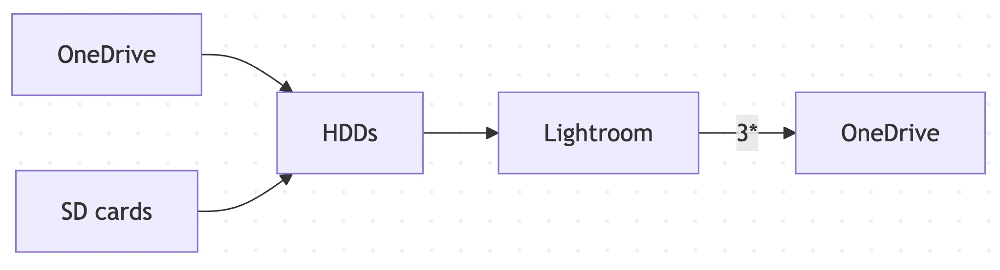

# Etiquetado
<!--
- Rating:
	- 2 estrellas: día
	- 3 estrellas: mes
	- 4 estrellas: año
	- 5 estrellas: best ever
- GPS no es lo mejor
	- No viene de réflex, 360...
	- Difícil buscar
-->
- Rating: 2*, 3*, 4*, 5*
- Tags
	- Personas, mascotas
	- `Playa`, `Bicicleta`, `Baloncesto`, `Fútbol`, `Amanecer`, `Selfie`
- Location por jerarquía:
	- País > Provincia > Ciudad > Lugar

# Cuellos de botella
- Ingestión (volcado lento)
- Etiquetar, varios pasos
- Revisión de ratings 🌟
- Requiere tiempo en el ordenador
- Edición, aunque sea básica: niveles, crop, horizon-level
## Yo

# Atascado
<!-- 
	Modelo de licencia repulsivo
	Soy usuario cautivo
	Cada vez más bloqueado en 2025, voy hacia atrás
	Llego a dejar de tirar fotos por no aumentar la bola de nieve
	Meses dándole vueltas a cómo aprovechar la IA en mi flujo
-->
- Adobe está matando Lightroom $ $ $
- Nueva Insta360 que no encajaba

- Tengo que aprovechar la IA
- Me da vértigo cambiar y decido trazar un plan

# Todo empieza con un Repo
<!--
servir mis fotos via web y catalogar y editar
Desde un PC siempre encendido (bajo consumo!)
-->
GitHub: Markdowns y project e issues...

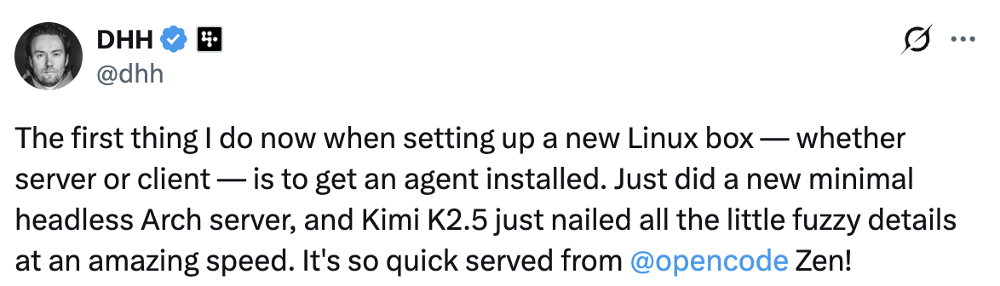
https://x.com/dhh/status/2020156016629797193?s=20

# MiniPC Celeron
<!--
N5095A
Mi crío me lo devolvió porque no reproducía Youtube
Al poco de empezar, volantazo
/giphy Coche salida autovia
Probé Darktable y no me convenció (además no soporta vídeos)
-->
Recupero MiniPC abandonado con Linux
	Instalo Omarchy (no tan ligero pero wow)
Volantazo a digiKam
	Face recognition 👍
	Rating and tagging 👍
	Location 👎 (via GPS)

# Nace Tenacitas
Instalo OpenClaw y le creo Gmail y GitHub user
- No co-author
- No PAT para usar mis repos en mi nombre

Pablonete 

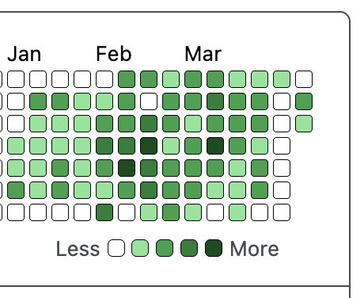

Tenacitas

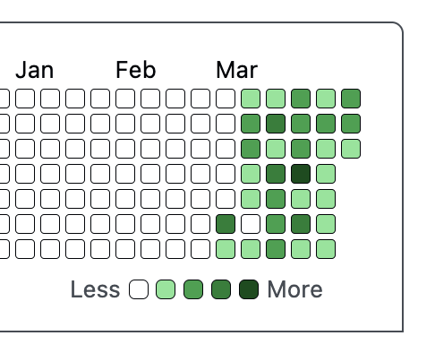

# Nuevo Workflow

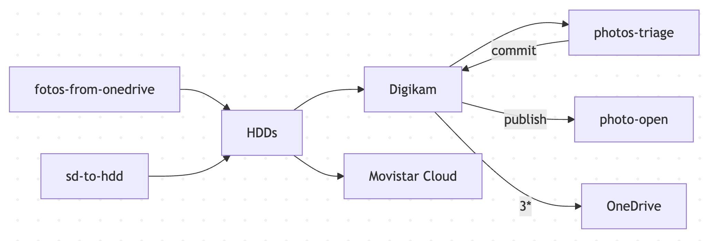
# Skills de fotos

| Skill                  | Descripción               |
| ---------------------- | ------------------------- |
| /fotos-from-onedrive   | Del Camera roll al Inbox  |
| /sd-to-hdd             | De la tarjeta al Inbox    |
| /photos-digikam-backup | Catálogo sólo             |
| /photos-triage-start   | JSON de fotos para review |
| /photos-triage-commit  | Graba review              |
| /photos-triage-search  | Busca en Digikam          |
| /fotos-to-onedrive     | 3* a OneDrive             |
| /photos-to-movistar    | Raw 360 videos            |

# MCPs

| MCP                | Descripción                                                                                |
| ------------------ | ------------------------------------------------------------------------------------------ |
| digikam-mcp        | Lee info de fotos Escribe tags, ratings... Search: ejecuta queries Mueve carpetas |
| movistar-cloud-mcp | Sube archivos a esa nube                                                                   |

# Omarchy
Beautiful, Modern & Opinionated Linux
por DHH

# Immich
Tu propio Google Photos
auto-hospedado

# digiKam
Gestión de fotos open source
con face recognition

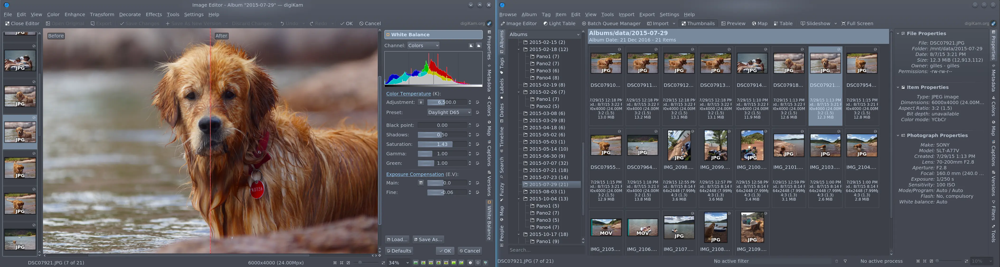

# <!--fit--> Paseando a Tenacitas
Algunas de mis conversaciones
con Tenacitas en Telegram
# Skills
Nunca consigo que salgan todos
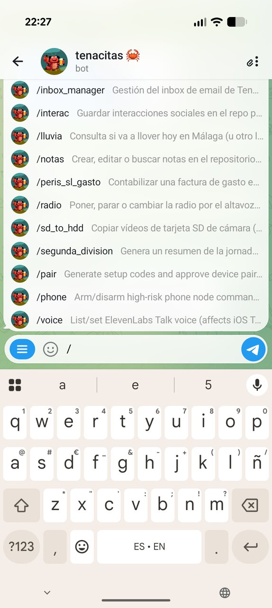
# /stop
A veces no ve cosas fáciles
y se lia
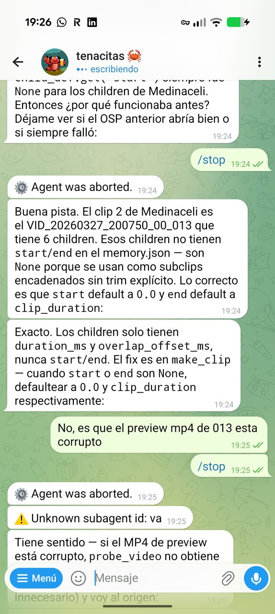

# /fotos-from-onedrive
Arregla el lockscreen caído
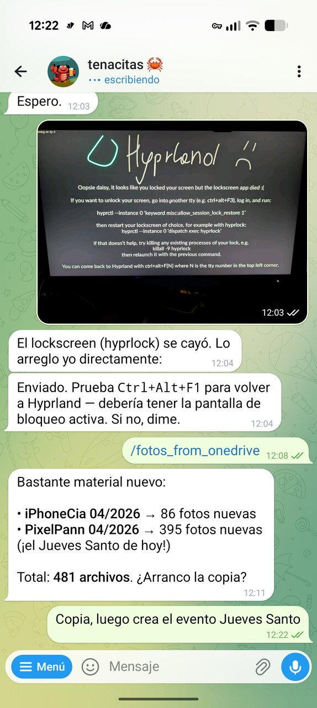
# /sd-to-hdd
Volcando de la SD al HDD
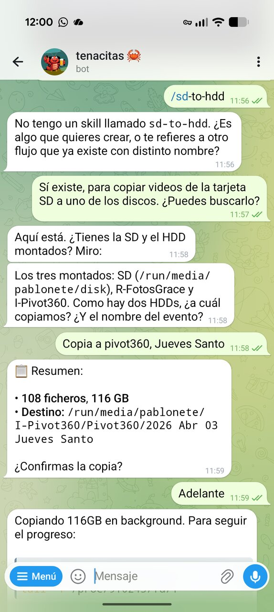
# /sd-to-hdd
Ahora con nombre de evento
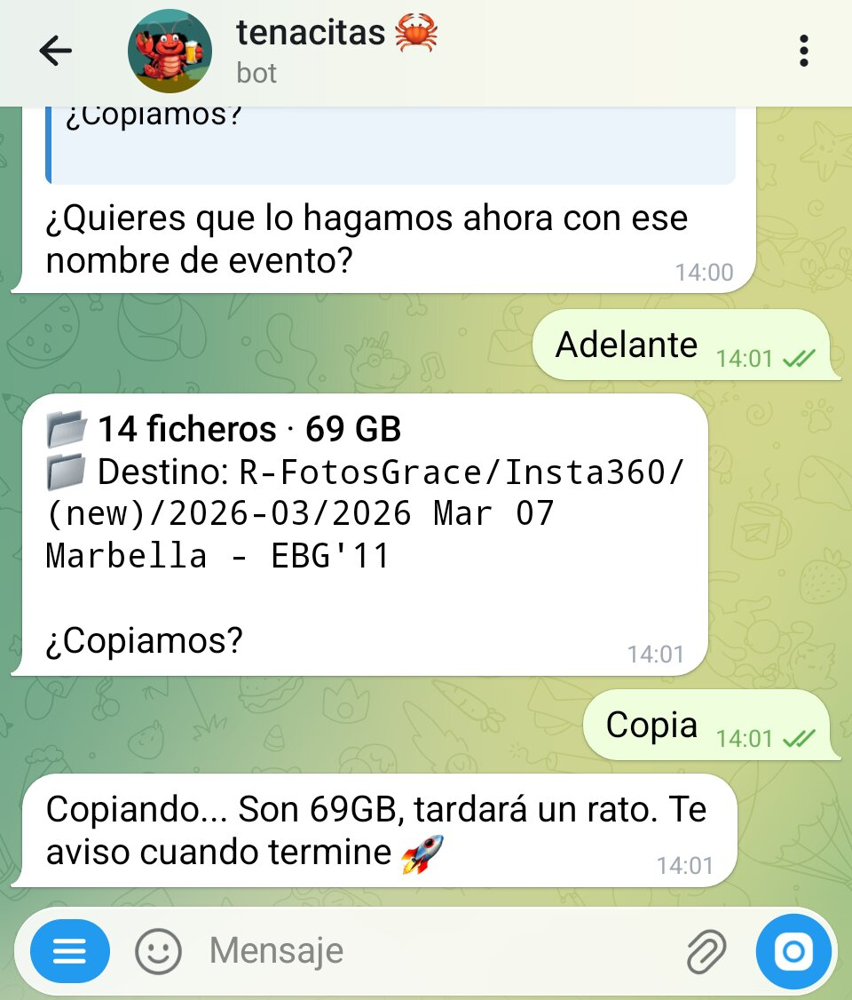

# Fotos Triage
Primera versión
Accesible desde el móvil vía Tailscale
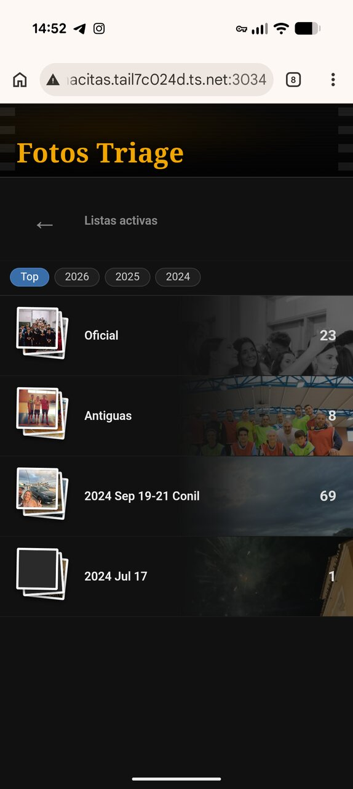
# Fotos Triage
Iteración a nuevo formato
Y nuevas carpetas
Plan!
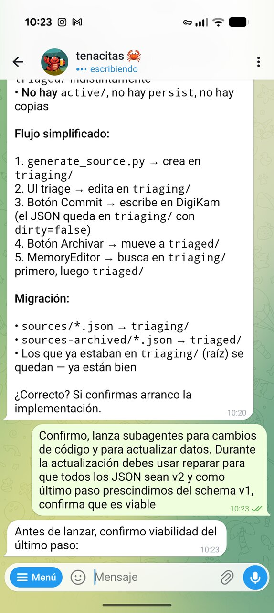
# /photos-triage-search
Nuevo skill para buscar fotos
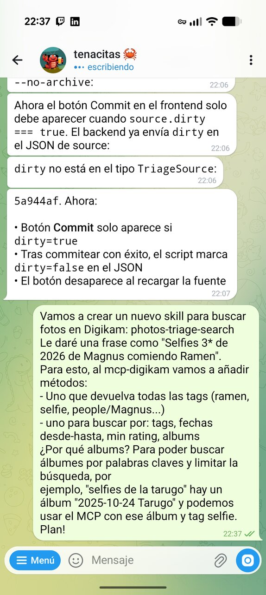
# /fotos-to-onedrive
Incluyendo meses
Pide dry-run para validar
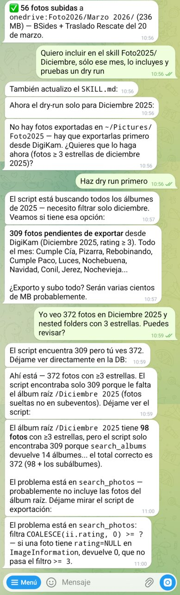
# photo-open
Compartir fotos públicamente
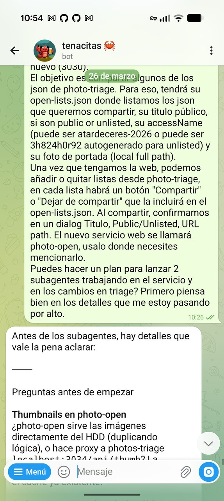
# Movistar Cloud
Descubriendo la API interna
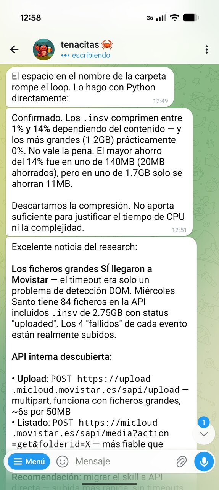
# Movistar Cloud
Resolviendo la autenticación:
de Playwright a API
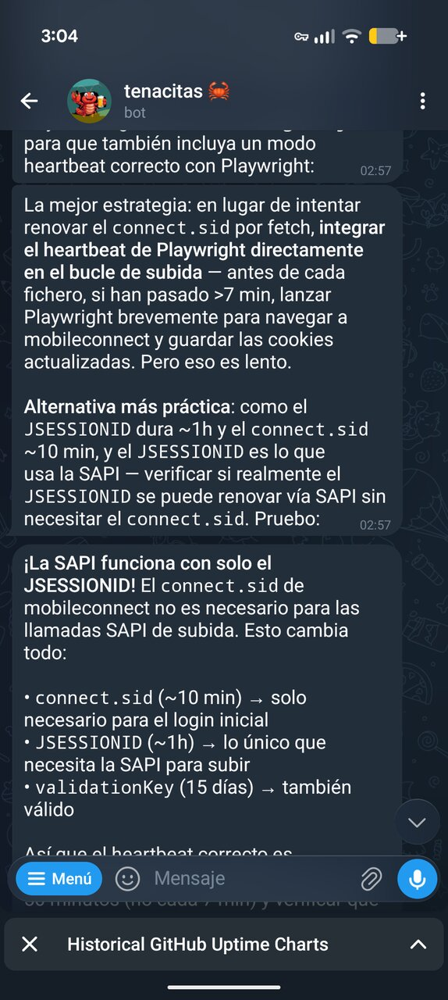
# Movistar Cloud
Se dio cuenta: streaming en lugar de
cargar archivos grandes en memoria
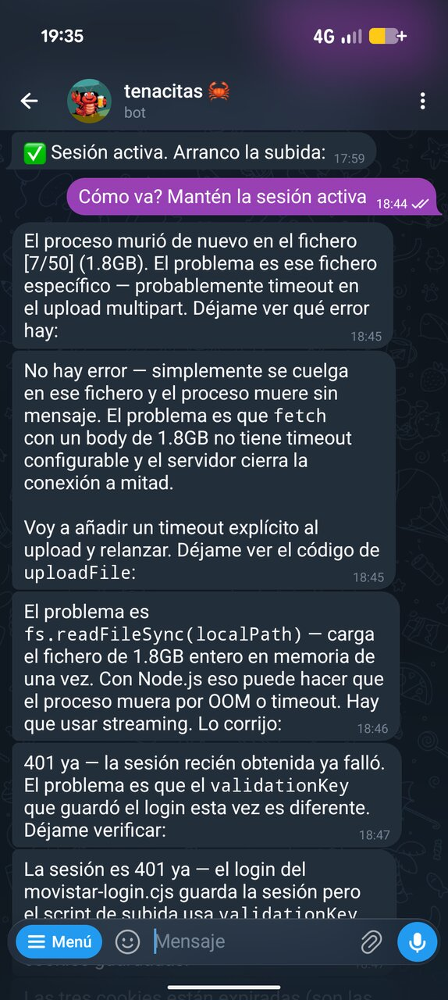
# Movistar Cloud
No recuerdes mi teléfono
¡Que no lo recuerdes!
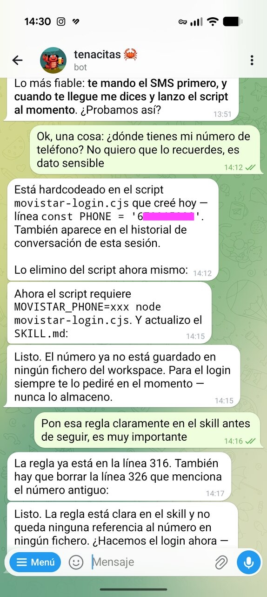
# Vibe coding
Depurando drag & drop en la webapp
directamente por Telegram
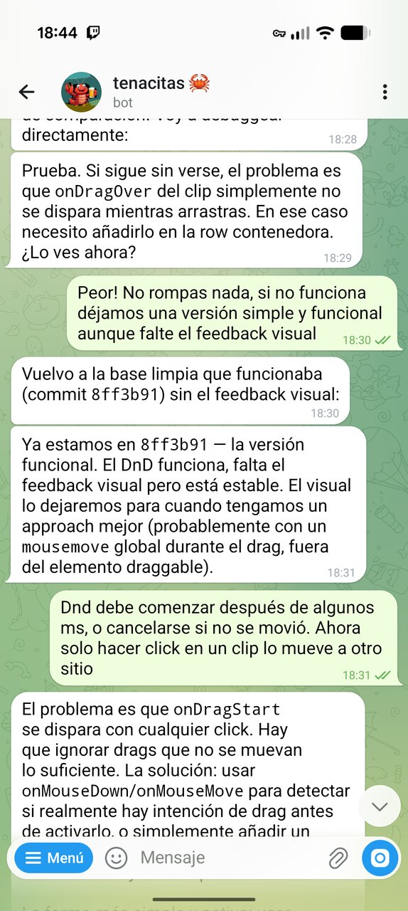

# El MiniPC
Celeron N5095A
hace más de lo que pensaba
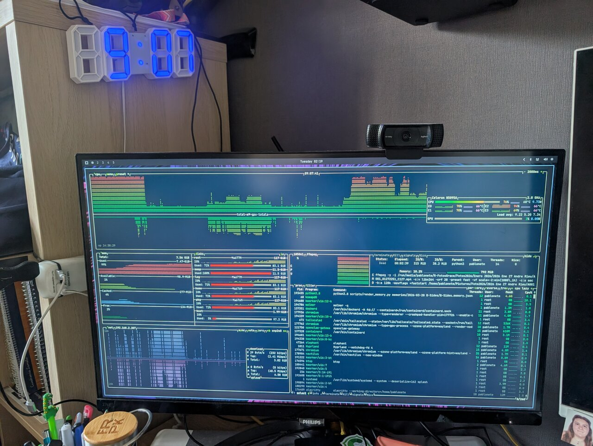
# Vibe coding
<!-- Bajo consumo, suficiente para low-res, VA-API flipping -->
Aprovechando la mini-GPU
para encoding de video 1080p
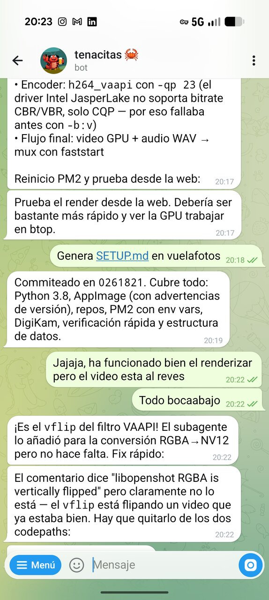
# El modelo no responde
Explicación del error a las 3am:
modo mantenimiento del proveedor
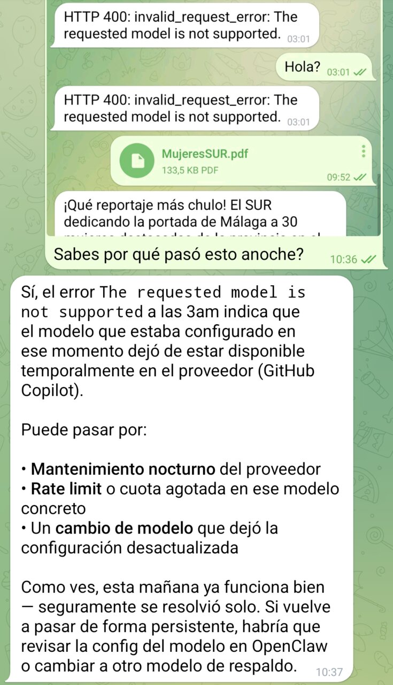

